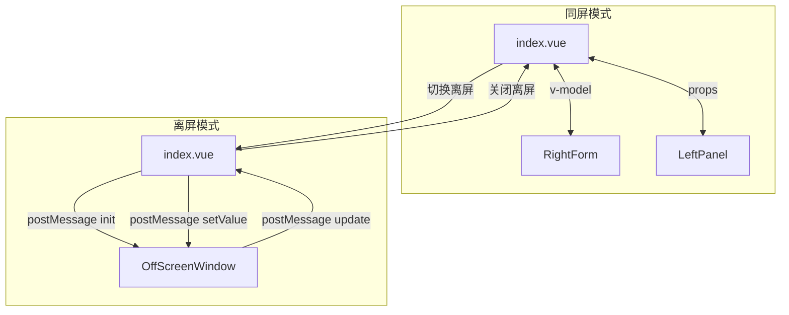
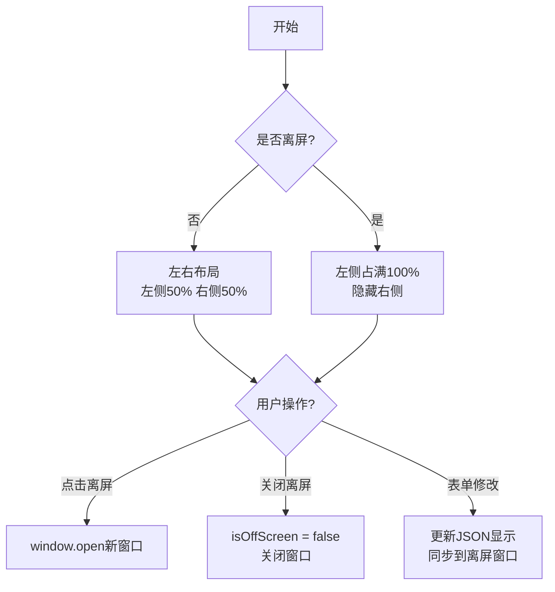

# 离屏通信 Demo 实现计划

## 需求概述

实现一个左右布局的 Demo：
- **左侧**：显示 JSON 数据和一些控制按钮
- **右侧**：表单区域
- **联动功能**：
  - 左侧按钮可以修改右侧表单的值
  - 右侧表单修改时，左侧 JSON 实时联动显示
- **离屏功能**：
  - 右侧表单可以拖到另一个屏幕显示
  - 离屏时左侧占满整个页面

## 技术方案

采用分层策略：
- **同屏时**：直接使用 Vue props/v-model 数据绑定
- **离屏时**：使用 `window.open()` + `postMessage` 进行跨窗口通信

## 文件结构

```
src/views/assembly/offScreenComm/
├── index.vue                  # 主页面（左右布局容器）
├── components/
│   ├── LeftPanel.vue          # 左侧面板（JSON显示 + 按钮）
│   └── RightForm.vue          # 右侧表单组件
├── OffScreenWindow.vue        # 离屏窗口页面（通过 URL 参数加载）
├── utils/
│   └── channelManager.ts      # postMessage 通信封装
└── index.scss                 # 样式文件
```

## 数据流设计



## 通信协议

```typescript
// 消息类型
type MessageType = 'init' | 'update' | 'setValue' | 'close' | 'ping'

// 消息格式
interface Message {
  type: MessageType
  data?: any
  timestamp?: number
}
```

## 布局切换逻辑



## 实现步骤

### 1. channelManager.ts - 通信工具
- `ChannelManager` 类封装 postMessage
- `postMessage(type, data)` - 发送消息
- `onMessage(callback)` - 监听消息
- `close()` - 关闭连接

### 2. RightForm.vue - 右侧表单组件
- 表单字段：用户名、邮箱、手机号、状态
- 支持 `v-model` 双向绑定
- 触发 `change` 事件通知父组件

### 3. LeftPanel.vue - 左侧面板
- JSON 显示区域（实时显示表单数据）
- 控制按钮：
  - "打开离屏窗口" - 打开新窗口
  - "关闭离屏窗口" - 关闭新窗口
  - "设置表单值" - 预设几个按钮修改表单

### 4. OffScreenWindow.vue - 离屏窗口
- 通过 URL 参数接收初始数据
- 表单修改时发送 `update` 消息给主窗口
- 接收主窗口发来的 `setValue` 消息更新表单

### 5. index.vue - 主页面
- 左右布局（flex）
- 状态管理：
  - `formData` - 表单数据
  - `isOffScreen` - 是否离屏状态
  - `offscreenWindow` - 离屏窗口引用
- 联动逻辑：
  - 左侧按钮 → 更新 formData → 同步到右侧/离屏窗口
  - 右侧表单 change → 更新 formData → 更新左侧 JSON

## 样式要点

- 主窗口：flex 布局
- 离屏窗口：正常宽度，最大宽度限制
- 响应式：无复杂花哨效果，简洁实用
