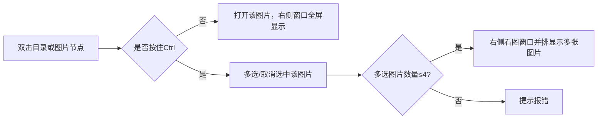
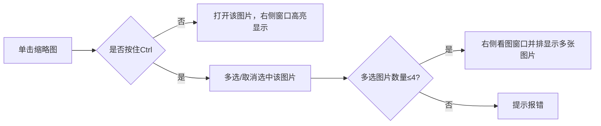
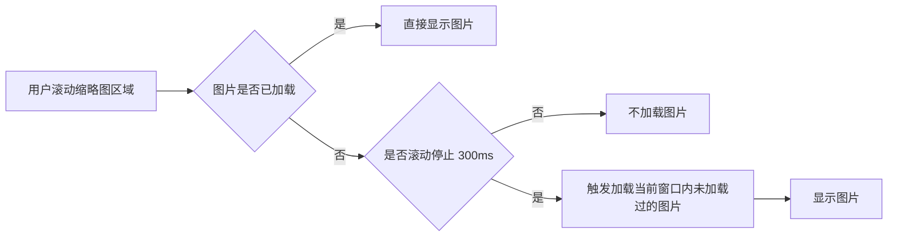

# 网页看图工具概述

本工具是一款基于网页的图片浏览器，采用三列式布局设计，旨在为用户提供高效、直观的图片管理与浏览体验。界面分为三大区域：

- **左侧：目录树**  
  展示本地或服务器上的图片文件夹结构，方便用户快速定位和切换不同图片目录。

- **中间：缩略图区**  
  以缩略图形式批量展示当前目录下的所有图片，支持快速预览与选择。

- **右侧：看图窗口**  
  显示用户选中的大图，支持放大、缩小、旋转等基础操作，满足详细查看图片的需求。

## 文件状态

1. 选中  ui显示上 背景色高亮
2. 右侧窗口打开 背景色高亮+边框高亮

## 目录树设计

目录树交互主要包括以下几个方面：

- **展开/收起文件夹**：点击文件夹图标可展开或收起其下级目录，便于层级浏览。
- **选中目录**：点击某一目录节点，缩略图区自动显示该目录下的所有图片。
- **右键菜单**：对目录节点点击右键，可弹出菜单，
- **搜索定位**：可在目录树上方输入关键字，快速定位到目标文件夹。
- **刷新目录**：支持手动刷新目录结构，及时同步文件系统的最新变化。
- **单击操作** 单击文件不直接打开图片 只影响缩略图选中状态

- **双击操作** 双击文件影响缩略图选中状态 也打开文件

双击目录或图片节点时，与单击不同，系统会直接在右侧看图窗口打开对应图片（或多张图片），实现快速预览。

### 技术选型

目录树部分计划基于 Element Plus 的 [Tree V2 虚拟化树形控件 | Element Plus](https://element-plus.org/zh-CN/component/tree-v2.html) 组件进行二次开发和定制。TreeV2 具备高性能虚拟滚动、节点懒加载、灵活的节点渲染等特性，能够满足大规模图片目录的高效展示需求。后续将在此基础上扩展多选、快捷键、缩略图联动等自定义交互逻辑。

## 缩率图设计

状态 
1. 选中 背景高亮
2. 打开 背景高亮 + 边框

### 工具栏

缩略图区域顶部设有工具栏，支持以下功能：
- **文件排序**：可根据文件名称、修改日期、文件大小等属性进行排序。
- **顺序/倒序切换**：支持升序与降序切换，便于用户按需浏览图片。
- **（可扩展）批量操作入口**：如批量下载、批量移动等。

### 交互

- **悬浮显示信息**：鼠标悬停在缩略图上时，显示该图片的文件名、大小、分辨率等详细信息。

### 滚动加载流程

缩略图区域采用 [vue-virtual-scroller](https://github.com/Akryum/vue-virtual-scroller) 实现虚拟滚动和懒加载：
- 只渲染当前可视区域内的图片，大幅减少 DOM 数量，提升性能。
- 如果图片已经加载过，滚动时直接显示。
- 如果图片未曾加载，在滚动过程中不加载图片。
- 仅在滚动停止后，由自动触发当前窗口范围内未加载图片的加载逻辑。

## 看图窗口

### 布局

1. 初始计划
   - **两窗口**：左右并排布局，便于对比查看。
   - **三窗口**：左、中、右三列均分布局。
   - **四窗口**：采用2x2井字格布局，四图均分显示。
2. 后续计划
   - 支持用户自定义窗口排列方式，如自由拖拽、调整大小、分组对比等，满足更灵活的看图需求。

### 交互

1. 多窗口

2. 缩放
- 缩放步长为 1.05，每次缩放操作按当前比例乘以或除以 1.05，实现平滑缩放。
- 缩放中心为鼠标指针所在位置，图片以鼠标中心进行缩放，提升操作直观性。
- 多窗口同步时，其余窗口的缩放中心参照操作窗口中鼠标点相对于图片左上角的距离进行同步缩放，确保多窗口对比时视角一致。

3.旋转 图片中心旋转 窗口顶部设置两个按钮， 不涉及多窗口同时操作

### 实现方案对比

| 维度         | 直接使用标签                           | 使用Konva.js（Canvas）                |
| ------------ | ------------------------------------------- | ------------------------------------- |
| 实现复杂度   | 实现简单，基于HTML和CSS即可，开发门槛低      | 实现复杂，需要掌握Canvas和Konva.js API，开发门槛高 |
| 交互能力     | 支持基础的缩放、旋转、移动，复杂交互有限      | 支持复杂交互（如标注、绘制、区域选择、多图层等） |
| 性能（看图窗口，最多四窗口） | 在最多四窗口下，基础缩放、旋转、移动等操作响应迅速，浏览器原生渲染流畅。多窗口同步操作时，性能表现良好，但如需更复杂的交互或动画，扩展性有限。 | 在最多四窗口下，Canvas 渲染可保持流畅的同步缩放、旋转、拖拽等高频交互，适合需要更精细控制和扩展的场景。资源消耗可控，适合复杂交互需求。 |
| 扩展性       | 扩展性一般，难以实现自定义图层和高级功能      | 扩展性强，易于集成自定义图层、标注、批量处理等高级功能 |
| 兼容性       | 兼容性好，主流浏览器均支持                   | 依赖Canvas，主流浏览器支持良好，部分低端设备性能有限 |
| 适用场景     | 常规图片浏览、基础缩放/旋转/移动             | 需要复杂交互、标注、绘制、区域选择、多图层等高级场景 |

**性能总结：**  
- 针对最多四窗口的同步缩放、旋转等看图交互，`` 
- 如需后续扩展更复杂的交互或自定义功能，Konva.js 方案更具优势。
